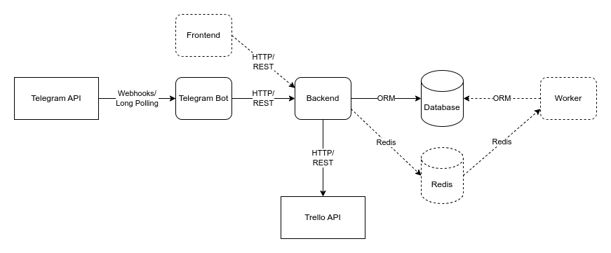

Intourist Telegram Bot
======================

## Overview

Intourist Telegram Bot is a bot to view tours' schedule, reserve a tour and make payments. The core functionality will
be focused on payment processing. Then I want to track all the info in DB (preferably PostgresSQL). Also, I would love
to figure out: Admin Panel for setting the schedule, checking reservations and payments, and probably configure it with
Trello (a current tool for tracking our signed up clients).

### Key Models

#### General

* User with administrative fields (group assignment client/guide/admin, permissions, is staff, is admin, is superuser)
  and profile information (photo, instagram etc.)
* Location
* Tour with location, schedule, common details
* TourInstance with tour, date, guide, tourists/group of tourists
* TouristAttendance

#### Billing

* Reservation
* Payment

#### Loyalty Program

* History
* Balance
* Levels

## Development Steps

#### Whole Product

- [x] Set up a basic echo bot to understand the Telegram Bot package
- [x] Set up a test payment bot to understand the logic of payments
- [x] Define the scope of work: web app, mobile app or **Telegram bot with Trello integration**
- [x] Define architecture and database
- [x] Define the tools for web side of application: **Django**, FastAPI, or custom solution
- [ ] Implement Backend on Django
- [ ] Implement Backend on FastAPI
- [ ] Implement Telegram Bot with Long Polling
- [ ] Implement Telegram Bot with Webhooks
- [ ] Implement Admin Panel
- [ ] Implement Trello Integration to track tours/clients/signups

#### Telegram-bot with Trello Integration

- [x] Basic payments
- [x] Basic FSM
- [x] Basic Trello API
- [x] Design business flow
- [x] Design architecture
- [x] Design database
- [ ] Implement user flow
- [ ] Implement business flow
- [ ] Notifications

#### User Flow

Get schedule with `/tours` command as a clickable elements. Pick up a tour. Provide name, phone and additional info.
Make payment.

#### Business Flow

The schedule is preserved in Google Sheets file (or better DB and Admin). The user: gets the scheduled tours
with `/tours` command. Pick up a tour. Provide number of people, name, phone (for each) and additional info. Make
payment. On successful payment, we update Trello Board by adding the new tourists to the corresponding tour.
Additionally, we can notify client the day before the tour (DB needed).

## Architecture

#### Architecture Design

Diagram: https://app.diagrams.net/#G1kII8pscdvBBm_9_xdTcLjCIcFc9lXsCN#%7B%22pageId%22%3A%22jlwJhWtSM1Rf5ebrzyMs%22%7D


We get updates from Telegram via long polling or webhooks to Telegram Bot. Telegram Bot utilizes Backend via HTTP/REST
to work with data. On Backend, we work with DB, synchronize data with Trello via API.

Technology used:

* Telegram Bot: Aiogram 3
* Backend: Django | FastAPI, SQLAlchemy, Alembic
* Database: PostgresSQL

#### Database Design

Diagram: https://drawsql.app/teams/elevendio/diagrams/intourist-database-design

Questions:

* Organization of roles (client, guide, admin) and permissions. We'll have users for clients and admin for now.
* Tour and Tour Instance. Which data should be in Tour which in Tour Instance? Should we copy some data to have
  precise statistics on prices in Tour Instance and allow modifications in Tours? Do it with payment value/quantity and
  preserve all the info that can be changed with creating a new version of Tour and deactivate the old one.
* Should we connect all logic to User or Profile? Do it inside a customized User.
* Is the tour is available? Group is full by max people constraint. Is group open boolean for tour group.

## Setup

### Install

For dockerized setup:

* [Docker](https://www.docker.com/) and [Docker Compose](https://docs.docker.com/compose/)

For local setup:

* Python Version Management [Pyenv](https://github.com/pyenv/pyenv) with `curl https://pyenv.run | bash`
* Python Packaging and Dependency Management [Poetry](https://python-poetry.org/docs/) with `python3 install poetry`

### Steps

1. Clone repository:
   ```
   git clone https://github.com/alinocco/intourist-telegram-bot.git
   ```
2. Go to the project folder:
   ```
   cd intourist-telegram-bot
   ```

For dockerized setup:

1. Set proper .env file (request .env files from the owner):
   ```
   cp documentation/docker/.env.docker .env
   ```

2. Run the backend with Docker Compose:
   ```
   docker-compose up -d
   ```

For local setup:

1. Set proper .env file (request .env files from the owner):
   ```
   cp documentation/docker/.env.docker-db .env
   ```

2. Run the database for backend with Docker Compose:
   ```
   docker-compose -f docker-compose-db.yml up -d
   ```

3. Go to backend folder:
   ```
   cd backend
   ```
4. Set up the proper Python Version with Pyenv:
   ```
   pyenv install
   ```
5. Initialize and go to a virtual environment with Poetry:
   ```
   poetry shell
   ```
6. Install dependencies:
   ```
   poetry install
   ```
7. Run the main script:
   ```
   python3 src/main.py
   ```

### Issues

* No auto restart of Django server on code update.
